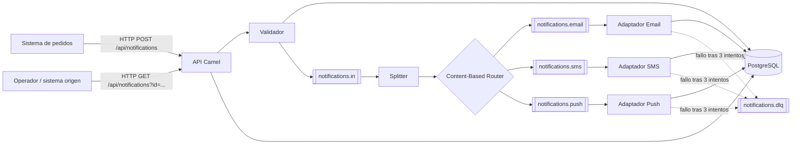

# Diseño de arquitectura

## Sistemas participantes

- **Sistema de pedidos:** productor externo que solicita la notificación.
- **API de integración:** endpoint síncrono implementado como ruta Camel.
- **Apache ActiveMQ Artemis:** mediador de mensajes y límite de desacoplamiento.
- **Orquestador Camel:** valida, divide, enruta, transforma y controla errores.
- **Proveedores Email, SMS y Push:** representados por adaptadores simulados y reemplazables.
- **PostgreSQL:** Message Store de solicitudes, entregas, estados e identificadores.
- **Operador/sistema origen:** consulta el resultado usando el identificador de correlación.

## Secuencia principal

1. La API valida el contrato y registra la solicitud con estado `QUEUED`.
2. Devuelve HTTP 202 y publica el mensaje en `notifications.in`.
3. El consumidor divide la solicitud en un mensaje por canal.
4. El router elige la cola específica según el contenido `channel`.
5. Cada adaptador traduce el modelo canónico al formato de su proveedor.
6. La entrega queda como `SENT`; cuando todas finalizan, la solicitud pasa a `COMPLETED`.
7. Ante un error se realizan dos reintentos adicionales. Luego se registra `FAILED` y el mensaje va a `notifications.dlq`.

## Canales

| Canal | Tipo | Propósito |
|---|---|---|
| `notifications.in` | Point-to-Point | Entrada asíncrona y durable. |
| `notifications.email` | Point-to-Point | Trabajo exclusivo del adaptador Email. |
| `notifications.sms` | Point-to-Point | Trabajo exclusivo del adaptador SMS. |
| `notifications.push` | Point-to-Point | Trabajo exclusivo del adaptador Push. |
| `notifications.dlq` | Dead Letter Channel | Inspección o reproceso manual de fallos definitivos. |

## Patrones EIP y justificación

| Patrón | Problema resuelto | Aplicación |
|---|---|---|
| Message Channel | Evitar acoplar productor y consumidores. | Colas JMS de Artemis. |
| Point-to-Point Channel | Un mensaje debe ser procesado una sola vez por canal. | Todas las colas de trabajo. |
| Canonical Data Model | Evitar formatos distintos durante el enrutamiento. | `NotificationRequest` y `ChannelMessage`. |
| Message Filter / Validator | Rechazar contratos incompletos antes de publicarlos. | `NotificationValidator`. |
| Splitter | Una solicitud puede pedir varios canales. | Un `ChannelMessage` por canal. |
| Content-Based Router | Seleccionar el consumidor de acuerdo con el contenido. | Elección EMAIL, SMS o PUSH. |
| Message Translator | Cada proveedor espera un contrato diferente. | `ProviderAdapter.toProviderPayload`. |
| Correlation Identifier | Relacionar solicitud y entregas asíncronas. | UUID `notificationId` en todos los mensajes. |
| Idempotent Receiver | Evitar procesar dos veces una orden externa. | Restricción única sobre `external_id`. |
| Message Store | Consultar estado aun después de reiniciar. | Tablas PostgreSQL. |
| Dead Letter Channel | Aislar mensajes que agotaron reintentos. | `notifications.dlq`. |

## Decisiones y límites

Los proveedores son simulados para mantener la entrega autocontenida. Un destino que contiene `fail`
produce un error controlado. Cambiar la simulación por una API real solo requiere sustituir el método
`send` del adaptador; las colas y el modelo canónico permanecen iguales.
